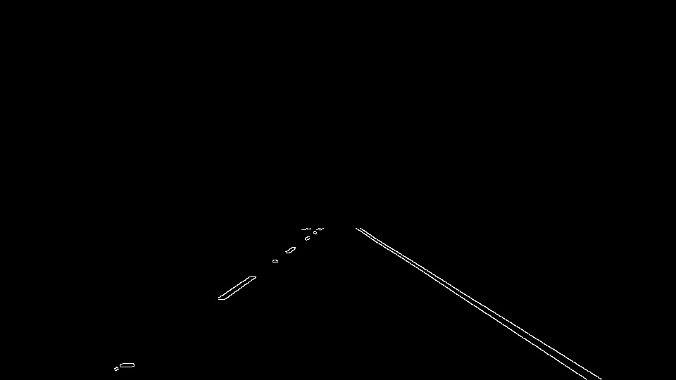
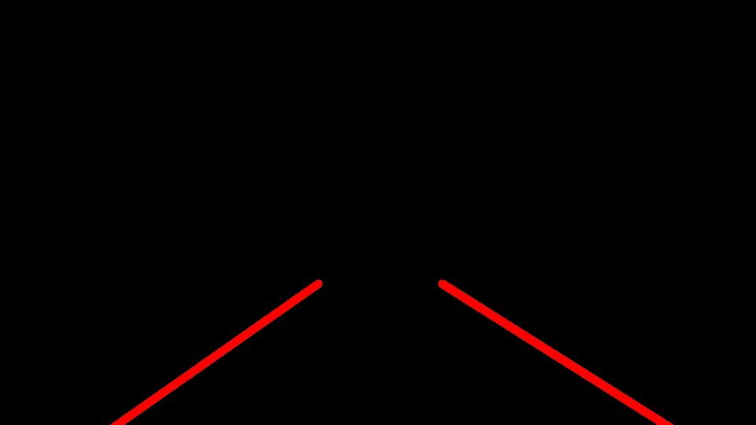

# Finding Lane Lines on the Road

### Goals

The goals / steps of this project are the following:
* Make a pipeline that finds lane lines on the road
* Run this pipeline on videos
* Discuss problems and possible solutions

-
### Pipeline

0. Input Image 

1. Convert to grayscale

2. Detect edges with Canny Edge Detection 

3. Naively mask the edges to only containe the road

4. Use Hough Transforms to detect lines and combine to a left and right lane

5. Overlay Left/Right Lines

### Problems

1. The pipeline assumes an empty road infront of it.
2. The lines are jittery
3. The mask is constant and could ignore part of a lane of a sharp turn
4. Filtering for too steep / horizontal lines could get rid of important lines

### Solutions

1. Detect cars and only process lines below the car
2. Smooth lines between frames
3. Naively assume lane lines will be the same color (or same two colors) and only process lines of that color
4. Instead of filtering out lines, use a clustering algorithm to determine the most prevalant line

